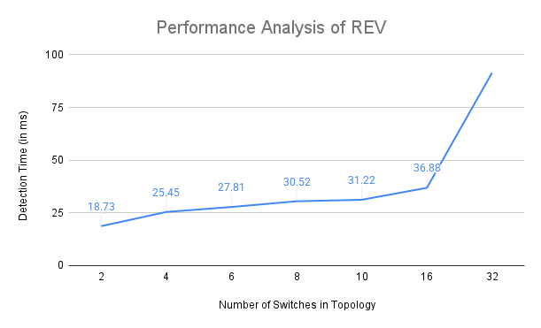

# Rule Enforcement Verification (REV)

> This enables the controller to verify if the rules that it issued have been properly enforced.

## Table of Contents
* [General Info](#general-information)
* [Technologies Used](#technologies-used)
* [How To Run?](#how-to-run)
* [Test Results](#test-results)
* [Contact](#contact)

## General Information

The main goal of this is to prevent attacks on a network like Path Deviation and Unauthorized Access. Implemented this in a BMV2 environment.

## Technologies Used

* scapy - 2.5.0
* p4 compiler - 1.2.4.14 ([Download VM here](https://drive.google.com/file/d/1mUspxxo7sG0-omvnu6IJasKKSP0PVbCj/view))

## How To Run?

1. Clone the repository.
2. CD into **rev** directory.
3. Run the following commands:
   ```
       $./disable_ipv6.sh
       $make run TOPO_DIR=<topology directory path>
   ```
   By default, **TOPO_DIR = topologies/topo4/**
   
4. When the mininet is up, run the following command:
   ```
       mininet> xterm h1 h<n>
   ```
   where *n = highest number of switch you have in the topology*
   
5. Open a new terminal and run the following command:
   ```
       $sudo python3 controller.py --topo=<path to the topology.json file you're using in the network>
   ```
   By default, **topo = topologies/topo4/topology.json**
   
6. In the hn's xterm, run the following command:
   ```
       #python3 receive.py
   ```
7. In the h1's xterm, run the following command:
   ```
       #python3 send.py <destination ip> <message> <number of packets>
   ```
8. Now, switch to the terminal where *controller.py* is running and you can see whether the rule enforcement was successfull or compromised.

## Test Results

The Rule Enforcement Verification works well and is able to detect any kind of deviations and unauthorized access. The following table shows the average time in **ms** taken by REV algorithm to verify the rule enforcement taken over different topologies.

| Number of switches in topology | Average time taken in ms |
| ------------------------------ | ------------------------ |
| 2                              | 18.73                    |
| 4                              | 25.45                    |
| 6                              | 27.81                    |
| 8                              | 30.52                    |
| 10                             | 31.22                    |
| 16                             | 36.88                    |
| 32                             | 91.43                    |



## Contact
Implemented by Devansh Garg - feel free to conatct me!
gargdevansh1806@gmail.com
